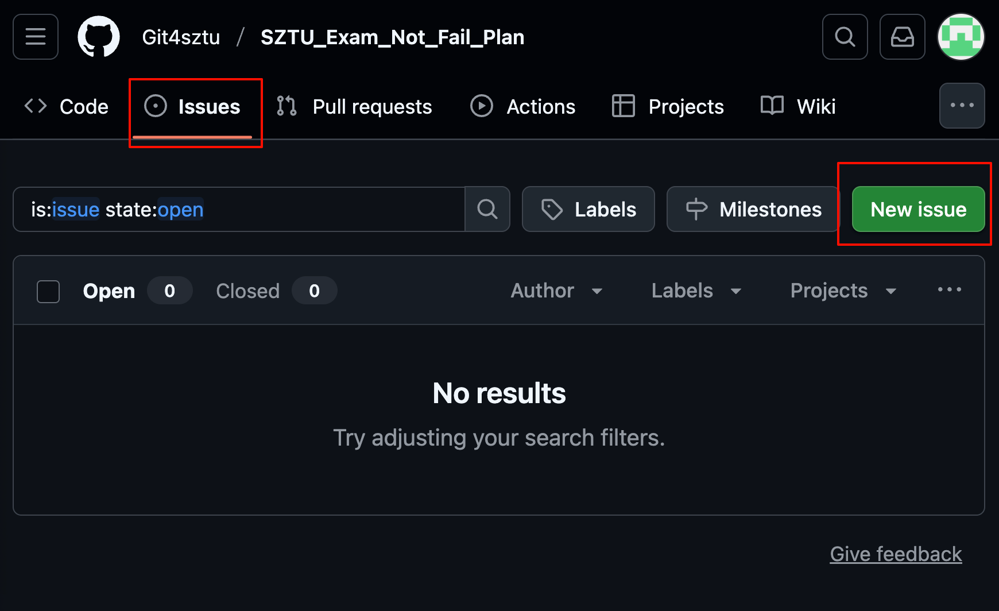

# SZTU共享不挂科计划

## License
**CC BY-NC 4.0**

## 写在前面

创建本项目的初衷在于让同学们更加方便有效地进行期末复习备考。

~~自2024-2025学年起，SZTU正式开启了有两周复习周的学期形式，相比过往无复习周的学期来说，有复习周的期末考试难度必然增大~~（一个学期过去了，然而并没有复习周），加之偶然发现CUIT的共享复习资料github库，SZTU共享不挂科计划的想法由此诞生。

本项目中，你可以上传关于SZTU任意课程的考前划重点复习资料和试题真题

## 规范

### 命名

课程编号课程名称/20xx-20xx-x/资料名称

eg：IB00065算法设计与分析/2024-2025-1/期末真题

### 隐私安全

上传资料**请勿泄露相关教师的信息**，请检查各类文件中是否有相关信息，如有请删除敏感信息后再上传。

##### 可能泄露的信息点

1. 文件属性详情的作者、标题信息

2. 文件内容中的个人信息、教师信息、班级信息

## 上传资料方法

### 方法一：Issues板块提交（上传方便）

### 方法二：fork仓库，提交pr（降低仓库维护人的负担）

具体方法自学

# Stargazers over time

   
